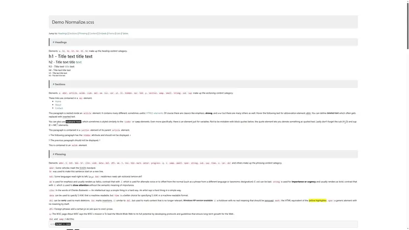

<p align="center">
    <a href="#">
        
    </a>
</p>

<p align="center">
    <a href="#"></a>
    <a href="#"></a>
    <a href="#"></a>
</p>

<p align="center">
    Сustomisable CSS/SCSS project that makes browsers render all elements.
    <br />
    <a href="mailto:q.6110@mail.ru">Report bug</a>
    ·
    <a href="mailto:q.6110@mail.ru">Request feature</a>
</p>

<div id="user-content-toc">
    <ul align="center" style="list-style: none;">
        <summary>
            <h1>
                Modern Normalize.scss
            </h1>
        </summary>
    </ul>
</div>

## Table of Contents

<details>
    <summary>
        <b>Expand list</b>
    </summary>
    <ul>
        <li>
            <a href="#about-the-project">
                About The Project
            </a>
        </li>
        <li>
            <a href="#demo">
                Demo
            </a>
        </li>
        <li>
            <a href="#features">
                Features
            </a>
        </li>
        <li>
            <a href="#browser-support">
                Browser support
            </a>
        </li>
        <li>
            <a href="#details">
                Details
            </a>
        </li>
        <li>
            <a href="#installation">
                Installation
            </a>
        </li>
        <li>
            <a href="#running-locally">
                Running locally
            </a>
        </li>
        <li>
            <a href="#example-mixins">
                Example mixins
            </a>
            <ul>
                <li>
                    <a href="#api-overview">
                        API Overview
                    </a>
                </li>
                <li>
                    <a href="#box-sizing-and-z-index-example">
                        Box-sizing and z-index Example
                    </a>
                </li>
                <li>
                    <a href="#font-smooth-example">
                        Font-smooth Example
                    </a>
                </li>
                <li>
                    <a href="#disable-animation-example">
                        Disable animation Example
                    </a>
                </li>
            </ul>
        </li>
        <li>
            <a href="#custom-variables">
                Custom variables
            </a>
        </li>
        <li>
            <a href="#example-variables">
                Example variables
            </a>
            <ul>
                <li>
                    <a href="#initial-variables">
                        Initial variables
                    </a>
                </li>
                <li>
                    <a href="#use-variables">
                        Use variables
                    </a>
                </li>
            </ul>
        </li>
        <li>
            <a href="#conclusion">
                Conclusion
            </a>
        </li>
        <li>
            <a href="#requirements">
                Requirements
            </a>
        </li>
        <li>
            <a href="#support">
                Support
            </a>
        </li>
        <li>
            <a href="#license">
                License
            </a>
        </li>
    </ul>
</details>

## About The Project

This project is normalize browsers default styles.
The normalize.scss makes browsers render all elements more
consistently and in line with modern standards.
Performance and sites develop must always be good
performance optimized.

Use `normalize.scss` as a starting point for your own project's base Sass,
customising the values to match the design's requirements.

## Demo

<p>
    <a href="https://codesandbox.io/p/github/veffo/Normalize.scss" target="_blank">
        Click here
    </a>
</p>

<p>
    <a href="#">
        
    </a>
</p>

## Features

<ul>
    <li>
        Useful browser defaults, rather than erasing them.
    </li>
    <li>
        Correct bugs and common browser inconsistencies.
    </li>
    <li>
        Improve usability with subtle modifications.
    </li>
    <li>
        Fast-and-easy implementation.
    </li>
    <li>
        Legacy IE support properties.
    </li>
    <li>
        Performance.
    </li>
    <li>
        Customizable utility classes.
    </li>
</ul>

## Browser support

* Google Chrome 88+
* Microsoft Edge 88+
* Mozilla Firefox 78+
* Safari/iOS 14+
* Opera 74+
* Internet Explorer 9+

## Details

#### `pre, code, kbd, samp`

The `font-family: monospace, monospace` hack fixes the inheritance and scaling
of font-size for preformatted text. The duplication of `monospace` is
intentional.

#### `sub, sup`

Normally, using `sub` or `sup` affects the line-box height of text in all
browsers.

#### `select`

By default, Chrome on OS X and Safari on OS X allow very limited styling of
`select`, unless a border property is set. The default font weight on `optgroup`
elements cannot safely be changed in Chrome on OSX and Safari on OS X.

#### `[type="checkbox"]`

It is recommended that you do not style checkbox and radio inputs as Firefox's
implementation does not respect box-sizing, padding, or width.

#### `[type="number"]`

Certain font size values applied to number inputs cause the cursor style of the
decrement button to change from `default` to `text`.

#### `[type="search"]`

The search input is not fully stylable by default. In Chrome and Safari on
OSX/iOS you can't control `font`, `padding`, `border`, or `background`. In
Chrome and Safari on Windows you can't control `border` properly. It will apply
`border-width` but will only show a border color (which cannot be controlled)
for the outer 1px of that border. Applying `-webkit-appearance: textfield`
addresses these issues without removing the benefits of search inputs (e.g.
showing past searches).

## Installation

To install for local use, download this repo and copy everything from this repository to:

```bash
# Clone this repository
git clone https://github.com/veffo/normalize.scss

# Go into the repository
cd normalize.scss
```

Install [Node](http://nodejs.org) (comes with [NPM](http://npmjs.com)):

```shell
npm install
```

With [Yarn](https://yarnpkg.com):

```shell
yarn install
```

## Running locally

To generate the dev work:


```shell
npm run dev
```

To generate the app build:


```shell
npm run build
```

Basic visual build are in `build/index.html`.

## Example mixins

#### API Overview

Box shadow mixin.

```scss
// Accepts all valid CSS values for browser normalization.
@include boxSizing($value);
```

Animation mixin.

```scss
// Accepts all valid CSS values for animation, as well as "none".
@include animation($name, $delay: 0, $timingFunction: "ease", $duration: 0, $iterationCount: "initial", $direction: "initial", $fillMode: "initial", $playState: "initial");
```

Disable animation mixin.

```scss
// Its advantage for browser disable all animation.
@include disableAnimation();
```

Transition mixin.

```scss
// Accepts all valid CSS values for browser normalization.
@include transition($value...);
```

#### Box-sizing and z-index Example

Here is a simple usage box-sizing.

```scss
a {
    @include boxSizing(border-box);
}
```

Here is a simple usage box-sizing and z-index.

```scss
img,
svg {
    @include zIndex(1);
    vertical-align: middle;
    margin: 0;
    padding: 0;
    @include boxSizing(border-box);
}
```

#### Font-smooth Example

Here is a simple usage font-smooth.

```scss
.smoothed {
    @include fontSmooth(antialiased, grayscale);
}
```

#### Disable animation Example

Here is a simple usage disable animation.

```scss
@mixin disableAnimation {
    @include animation($name: none);
    @include transition(none 0s 0s);
    @include transform(none);

    scroll-behavior: auto;
}
```

## Custom variables

The colored elements are mixed with the base color to create a uniform color palette.

```scss
// Colors
$white: #ffffff;
$alabasterWhite: #fafafa;
$black: #000000;
$lightBlue: #add8e6;
$pacificBlue: #add8e6;
$agatGray: #b4b4b4;
$lightTelegray: #d3d3d3;

// Normalize colors
$color-body-normalize: $black;
$bg-color-body-normalize: $white;
$bg-color-video-normalize: $black;

$color-dialog-normalize: $black;
$bg-color-dialog-normalize: $white;
$border-color-dialog-normalize: $black;

// Content colors
$color-outline-content-svg-wrapper-classesCommon: $lightBlue;
$color-fill-content-svg-circle-classesCommon: $pacificBlue;
$color-outline-content-img-wrapper-classesCommon: $lightBlue;

// Forms colors
$color-forms-input-classesCommon: $agatGray;
$bg-color-forms-input-classesCommon: $alabasterWhite;
$color-border-forms-input-classesCommon: $lightTelegray;
$color-forms-button-label-classesCommon: $agatGray;
```

## Example variables

#### Initial variables

Initial all variables.

```scss
@use "../global/variables.custom" as cv;
```

#### Use variables

Add variable value in class.

```scss
.content-svg__wrapper {
    outline: 1px solid cv.$color-outline-content-svg-wrapper-classesCommon;
}
```

Add variables values in input.

```scss
input[disabled] {
    color: cv.$color-forms-input-classesCommon;
    background-color: cv.$bg-color-forms-input-classesCommon;
    border-color: cv.$color-border-forms-input-classesCommon;
}
```

## Conclusion

Normalization CSS/SASS gives developers a safe starting point at which to know styles are the same across browsers.
For projects where an element inventory is not looked after regularly or, perhaps if there are very very few styles,
CSS/SASS Normalize can guarantee normality of elements before any custom styling is done.

## Requirements

<ul>
    <li>
        Git
    </li>
    <li>
        Node
    </li>
    <li>
        NPM or Yarn
    </li>
</ul>

## Support

For all questions, please contact us by email: <a href="mailto:q.6110@mail.ru">q.6110@mail.ru</a>

## License

This project is open-sourced software licensed under the <a href="https://opensource.org/license/MIT" target="_blank">MIT license</a>.<br/>
Distributed under the <a href="https://opensource.org/license/MIT" target="_blank">MIT license</a>. See <a href="https://opensource.org/license/MIT" target="_blank">MIT license</a> for more information.
